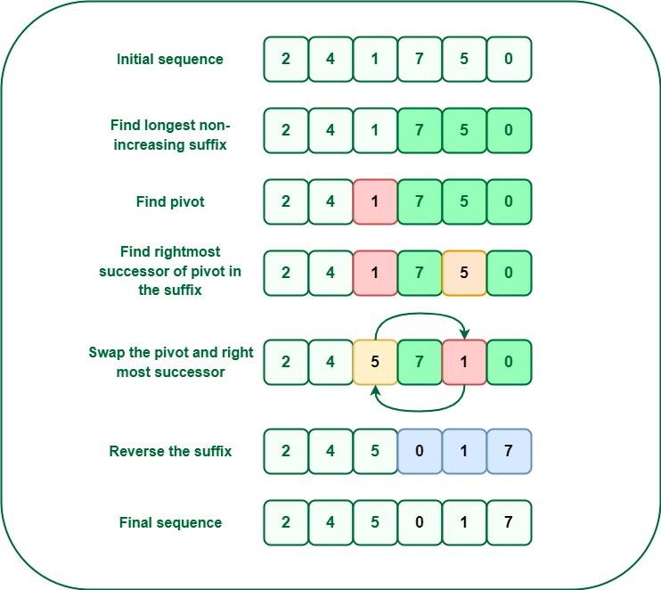

# 思考
作为提高自己英文的手段 我采取读英文看题目

无奈的是这道题略难呀 难点之一 题目没看懂？ 又是找题解学题的一天 

用人话是不是这样的？

Given an array arr[] of size N, the task is to print the lexicographically next greater permutation of the given array. If there does not exist any greater permutation, then print the lexicographically smallest permutation of the given array.

[英文](https://leetcode.com/problems/next-permutation/)

# 题解

So, it is clear that to get the next permutation we will have to change the number in a position which is as right as possible. Each permutation (except the very first) has a increasing suffix. Now if we change the pattern from the pivot point (where the increasing suffix breaks) to its next possible lexicographic representation we will get the next greater permutation.

    [3, 1, 3] = next greater number is 331
    [5, 1, 3] = next greater number is 531
    [1, 2, 3] = next greater number is 132
    [1, 3, 5, 4] = next greater number is 1435
    [3, 2, 1] = we can’t form a number greater than the current number from all the possible permutations

"Next permutation" refers to the concept of generating the next lexicographically greater permutation of a sequence or array of elements. It is often used to iterate through all possible permutations of a given set of elements.

    
    To implement the "next permutation" operation, you can follow the steps below:
    
    1 Starting from the right end of the sequence, find the first pair of adjacent elements (i, i+1) such that nums[i] < nums[i+1].
    
    2  If no such pair is found, it means the sequence is in decreasing order, and it represents the lexicographically largest permutation. In this case, you need to rearrange the sequence to the lowest possible order, which is the sorted order. You can reverse the entire sequence to achieve this.
    
    3 If a pair (i, i+1) is found in step 1, then you need to find the smallest element in the subarray nums[i+1:] that is greater than nums[i]. Let's call the index of this element j.
    
    4 Swap nums[i] with nums[j]. This ensures that the next permutation is lexicographically greater.
    
    5 Reverse the subarray nums[i+1:]. Since the subarray nums[i+1:] was in decreasing order, reversing it will make it the smallest lexicographically possible, resulting in the next greater permutation.

解题思路如下：

    1 从右向左遍历数组，找到第一个满足 nums[i] < nums[i+1] 的元素，记为索引 i。这个元素是当前排列中需要调整的位置。
    
    2 如果找不到满足条件的 i，说明整个数组是降序排列的，即当前排列已经是最大的，需要将数组反转为最小排列。
    
    3 如果找到了满足条件的 i，继续从右向左遍历数组，找到第一个满足 nums[j] > nums[i] 的元素，记为索引 j。这个元素是待交换的位置。
    
    4 交换 nums[i] 和 nums[j]，将较小的元素放到较大元素的位置。
    
    5 将索引 i+1 及其之后的元素进行反转，使其变为升序排列。

代码 

    
    
    def nextPermutation(nums):
        # 从右向左找到第一个满足 nums[i] < nums[i+1] 的元素
        i = len(nums) - 2
        while i >= 0 and nums[i] >= nums[i + 1]:
            i -= 1
    
        # 如果找不到满足条件的 i，数组是降序排列的，直接反转为最小排列
        if i < 0:
            nums.reverse()
            return
    
        # 从右向左找到第一个满足 nums[j] > nums[i] 的元素
        j = len(nums) - 1
        while j > i and nums[j] <= nums[i]:
            j -= 1
    
        # 交换 nums[i] 和 nums[j]
        nums[i], nums[j] = nums[j], nums[i]
    
        # 反转 i+1 及其之后的元素，使其变为升序排列
        nums[i+1:] = reversed(nums[i+1:])

